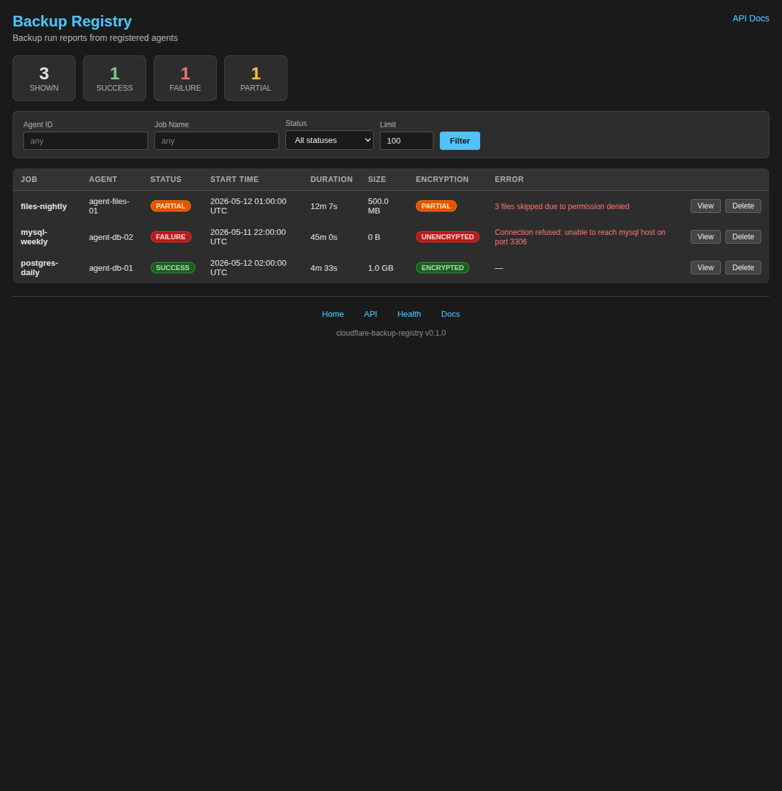

# cloudflare-backup-registry

A Cloudflare Workers app for collecting and displaying backup run reports submitted by backup agents. Runs entirely on Cloudflare's edge with zero infrastructure — state is held in a Durable Object.



## Features

- **`POST /v1/backup-runs`** — agents submit structured backup reports
- **Web UI** — dark-theme dashboard with status/encryption badges, duration, size, error display, and per-row delete
- **Filtering** — filter by agent ID, job name, and status via the UI or API query params
- **Authentication** — Basic auth, API tokens, or JWT/OIDC; open if unconfigured
- **No infrastructure** — Durable Object storage, no external database

## Quick start

```bash
npm install
npm run dev         # wrangler dev on http://localhost:8787
npm test            # vitest (31 tests)
npm run typecheck   # tsc --noEmit
```

Seed some test data:

```bash
curl -X POST http://localhost:8787/v1/backup-runs \
  -H "Content-Type: application/json" \
  -d '{
    "run_id": "550e8400-e29b-41d4-a716-446655440000",
    "job_name": "postgres-daily",
    "agent_id": "agent-db-01",
    "start_time": "2026-05-12T02:00:00Z",
    "end_time": "2026-05-12T02:04:33Z",
    "status": "success",
    "bytes_backed_up": 1073741824,
    "encrypted": true,
    "encryption_status": "encrypted"
  }'
```

## Payload schema

`POST /v1/backup-runs` — `Content-Type: application/json`

| Field | Type | Required | Notes |
|---|---|---|---|
| `run_id` | string | ✓ | Unique run identifier (UUID recommended). Re-submitting the same `run_id` overwrites. |
| `job_name` | string | ✓ | |
| `agent_id` | string | ✓ | |
| `start_time` | string | ✓ | ISO 8601 |
| `end_time` | string | ✓ | ISO 8601 |
| `status` | string | ✓ | `success` \| `failure` \| `partial` |
| `bytes_backed_up` | number | — | Non-negative |
| `encrypted` | boolean | — | |
| `encryption_status` | string | — | `encrypted` \| `unencrypted` \| `partial` \| `failed` |
| `error` | string \| null | — | Error message if status is not success |
| `metadata` | object | — | Arbitrary key/value pairs |

The server adds `received_at` (ISO 8601) on ingestion.

Returns `201 Created` with the stored object, or `400 Bad Request` with `{"error": "..."}` on validation failure.

## API reference

| Method | Path | Description |
|---|---|---|
| `POST` | `/v1/backup-runs` | Submit a backup run |
| `GET` | `/v1/backup-runs` | List runs (newest first) |
| `GET` | `/v1/backup-runs/:run_id` | Get a specific run |
| `DELETE` | `/v1/backup-runs/:run_id` | Delete a run |
| `GET` | `/` | Web UI |
| `GET` | `/docs` | API documentation |
| `GET` | `/health` | Health check |

### List query parameters

| Param | Description |
|---|---|
| `agent_id` | Exact match on agent ID |
| `job_name` | Exact match on job name |
| `status` | `success`, `failure`, or `partial` |
| `since` | ISO 8601 — only runs with `received_at ≥ since` |
| `limit` | Max results, default `100`, max `1000` |

## Authentication

Three methods are supported, checked in order. If none are configured, all requests are accepted (suitable for development).

| Method | How to use |
|---|---|
| **API token** (recommended for agents) | `Authorization: Bearer <token>` or `X-API-Key: <token>` |
| Basic auth | `Authorization: Basic <base64(user:pass)>` |
| JWT/OIDC | `Authorization: Bearer <jwt>` |

### Setting up API tokens for backup agents

Define `API_TOKENS` as a **Cloudflare Secret** (it is a credential and must never be stored in plain text or committed to source control):

```bash
npx wrangler secret put API_TOKENS
# Enter a comma-separated list of tokens, e.g.:
# agent-token-abc123,agent-token-def456
```

Agents then send one of those tokens in each request:

```bash
curl -X POST https://backups.example.com/v1/backup-runs \
  -H "Authorization: Bearer agent-token-abc123" \
  -H "Content-Type: application/json" \
  -d '{ ... }'
```

### Basic auth for UI/admin access

```bash
npx wrangler secret put AUTH_USER
# Enter: admin

npx wrangler secret put AUTH_PASS
# Enter: your-secure-password
```

### JWT/OIDC

Set `JWT_ISSUER`, `JWT_AUDIENCE`, and optionally `JWKS_URI` as secrets:

```bash
npx wrangler secret put JWT_ISSUER
npx wrangler secret put JWT_AUDIENCE
npx wrangler secret put JWKS_URI
```

## Deploy

```bash
npm run deploy
```

Requires `CLOUDFLARE_API_TOKEN` in the environment, or run `npx wrangler login` first.

## Configuration

`wrangler.toml` — update the custom domain to match your zone:

```toml
routes = [
  { pattern = "backup-registry.example.com", custom_domain = true }
]
```

## Agent example (shell)

```bash
#!/usr/bin/env bash
# Submit a backup run report after your backup completes.
curl -sf -X POST "https://backup-registry.example.com/v1/backup-runs" \
  -H "Authorization: Bearer ${BACKUP_REGISTRY_TOKEN}" \
  -H "Content-Type: application/json" \
  -d "$(jq -n \
    --arg run_id "$(uuidgen)" \
    --arg job_name "${JOB_NAME}" \
    --arg agent_id "$(hostname)" \
    --arg start_time "${START_TIME}" \
    --arg end_time "$(date -u +%Y-%m-%dT%H:%M:%SZ)" \
    --arg status "${STATUS}" \
    --argjson bytes "${BYTES_WRITTEN:-0}" \
    '{run_id:$run_id,job_name:$job_name,agent_id:$agent_id,start_time:$start_time,end_time:$end_time,status:$status,bytes_backed_up:$bytes}'
  )"
```
